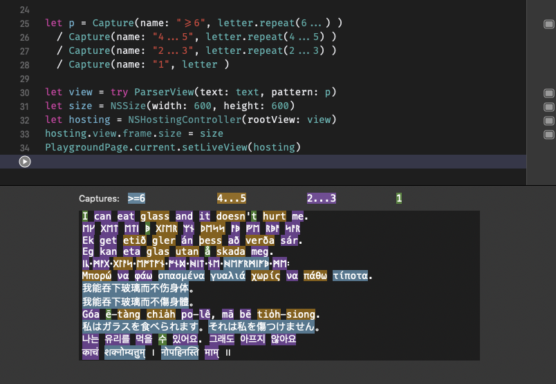

<p align="center">
   <a href="https://developer.apple.com/swift/">
      
   </a>
   <a href="https://github.com/apple/swift-package-manager">
      
   </a>
</p> 

# Patterns

Patterns is a Swift library for Parser Expression Grammars (PEGs). It can be used to create expressions similar to regular expressions (like regex’es) and grammars (for parsers).

For general information about PEGs, see [the original paper](https://dl.acm.org/doi/10.1145/982962.964011) or [Wikipedia](https://en.wikipedia.org/wiki/Parsing_expression_grammar).



To try out Patterns in a playground, open Playground/Playground.xcworkspace in Xcode.

## Example

```swift
let text = "This is a point: (43,7), so is (0, 5). But my final point is (3,-1)."

let number = ("+" / "-" / "") • digit+
let point = "(" • Capture(name: "x", number)
	• "," • " "¿ • Capture(name: "y", number) • ")"

struct Point: Codable {
	let x, y: Int
}

let points = try Parser(search: point).decode([Point].self, from: text)
// points == [Point(x: 43, y: 7), Point(x: 0, y: 5), Point(x: 3, y: -1)]
```

See also:
- [Parsing Unicode property data files](https://nottoobadsoftware.com/blog/textpicker/patterns/parsing_unicode_property_data_files/)

## Usage

Patterns are defined directly in code, instead of in a text string.

**Note**: Long patterns can give the Swift type checker a lot to think about, especially long series of `a / b / c / etc...`. To improve build times, try to split a long pattern into multiple shorter ones.

### Standard PEG

`"text"`

Text within double quotes matches that exact text, no need to escape special letters with `\`. If you want to turn a string variable `s` into a pattern, use `Literal(s)`.

`OneOf(...)`

This is like character classes (`[...]`) from regular expressions, and matches 1 character. `OneOf("aeiouAEIOU")` matches any single character in that string, and `OneOf("a"..."e")` matches any of "abcde". They can also be combined, like `OneOf("aeiou", punctuation, "x"..."z")`. To match any character _except_ ..., use `OneOf(not: ...)`.


You can also implement one yourself:

```swift
OneOf(description: "ten") { character in
	character.wholeNumberValue == 10
}
```

It takes a closure `@escaping (Character) -> Bool` and matches any character for which the closure returns `true`. The description parameter is only used when creating a textual representation of the pattern.

`a • b • c`

The • operator (Option-8 on U.S. keyboards, Option-Q on Norwegian ones) first matches `a`, then `b` and then `c`. It is used to create a pattern from a sequence of other patterns.

`a*`  

matches 0 or more, as many as it can (it is greedy, like the regex  `a*?`). So a pattern like `a* • a` will never match anything because the repeated `a` pattern will always match all it can, leaving nothing left for the last `a`.

`a+`

 matches 1 or more, also as many as it can (like the regex  `a+?`).

`a¿`

makes `a` optional, but it always matches if it can (the `¿` character is Option-Shift-TheKeyWith?OnIt on most keyboards).

`a / b`

This first tries the pattern on the left. If that fails it tries the pattern on the right. This is _ordered choice_, once `a` has matched it will never go back and try `b` if a later part of the expression fails. This is the main difference between PEGs and most other grammars and regex'es.

`&&a • b`

The "and predicate" first verifies that `a` matches, then moves the position in the input back to where `a` began and continues with `b`. In other words it verifies that both `a` and `b` match from the same position. So to match one ASCII letter you can use `&&ascii • letter`.

`!a • b`

The "not predicate" verifies that `a` does _not_ match, then just like above it moves the position in the input back to where `a` began and continues with `b`. You can read it like "b and not a".

#### Grammars

The main advantage of PEGs over regular expressions is that they support recursive expressions. These expressions can contain themselves, or other expressions that in turn contain them. Here is how you can parse simple arithmetic expressions:

```swift
let arithmetic = Grammar { g in
	g.all     <- g.expr • !any
	g.expr    <- g.sum
	g.sum     <- g.product • (("+" / "-") • g.product)*
	g.product <- g.power • (("*" / "/") • g.power)*
	g.power   <- g.value • ("^" • g.power)¿
	g.value   <- digit+ / "(" • g.expr • ")"
}
```

This will parse expressions like "1+2-3^(4*3)/2".

The top expression is called first. `• !any` means it must match the entire string, because only at the end of the string is there no characters. If you want to match multiple arithmetic expressions in a string, comment out the first expression. Grammars use dynamic properties so there is no auto-completion for the expression names.

### Additions

There are predefined OneOf patterns for all the boolean `is...` properties of Swift's `Character`: `letter`, `lowercase`, `uppercase`, `punctuation`, `whitespace`, `newline`, `hexDigit`, `digit`, `ascii`, `symbol`, `mathSymbol`, `currencySymbol`.

They all have the same name as the last part of the property, except for `wholeNumber`, which is renamed to `digit` because `wholeNumber` sounds more like an entire number than a single digit.

There is also `alphanumeric`, which is a `letter` or a `digit`.

`any`

Matches any character. `!any` matches only the end of the text.

`Line()` 

Matches a single line, not including the newline characters. So `Line() • Line()` will never match anything, but `Line() • "\n" • Line()` matches 2 lines.

`Line.start` matches at the beginning of the text, and after any newline characters. `Line.end` matches at the end of the text, and right before any newline characters. They both have a length of 0, which means the next pattern will start at the same position in the text.

`Word.boundary` 

Matches the position right before or right after a word. Like `Line.start` and `Line.end` it also has a length of 0.

`a.repeat(...)`

`a.repeat(2)` matches 2 of that pattern in a row. `a.repeat(...2)` matches 0, 1 or 2, `a.repeat(2...)` matches 2 or more and `a.repeat(3...6)` between 3 and 6. 

`Skip() • a • b`

Finds the first match of `a • b` from the current position.

### Parsing

To actually use a pattern, pass it to a Parser:

```swift
let parser = try Parser(search: a)
for match in parser.matches(in: text) {
	// ...
}
```

`Parser(search: a)` searches for the first match for `a`. It is the same as `Parser(Skip() • a)`.

The `.matches(in: String)` method returns a lazy sequence of `Match` instances.

Often we are only interested in parts of a pattern. You can use the `Capture` pattern to assign a name to those parts:

```swift
let text = "This is a point: (43,7), so is (0, 5). But my final point is (3,-1)."

let number = ("+" / "-" / "") • digit+
let point = "(" • Capture(name: "x", number)
	• "," • " "¿ • Capture(name: "y", number) • ")"

struct Point: Codable {
	let x, y: Int
}

let points = try Parser(search: point).decode([Point].self, from: text)
```

Or you can use subscripting:

```swift
let pointsAsSubstrings = point.matches(in: text).map { match in
	(text[match[one: "x"]!], text[match[one: "y"]!])
}
```

You can also use `match[multiple: name]` to get an array if captures with that name may be matched multiple times. `match[one: name]` only returns the first capture of that name.

## Setup

### [Swift Package Manager](https://swift.org/package-manager/)

Add this to your `Package.swift` file:

```swift
dependencies: [
    .package(url: "https://github.com/kareman/Patterns.git", .branch("master")),
]
```

or choose “Add Package Dependency” from within Xcode.

## Implementation

Patterns is implemented using a virtual parsing machine, similar to how [LPEG](http://www.inf.puc-rio.br/~roberto/lpeg/) is [implemented](http://www.inf.puc-rio.br/~roberto/docs/peg.pdf). See also the `backtrackingvm` function described [here](https://swtch.com/~rsc/regexp/regexp2.html).

## Contributing

Contributions are most welcome 🙌.

## License

MIT

```text
Patterns
Copyright © 2019

Permission is hereby granted, free of charge, to any person obtaining a copy
of this software and associated documentation files (the "Software"), to deal
in the Software without restriction, including without limitation the rights
to use, copy, modify, merge, publish, distribute, sublicense, and/or sell
copies of the Software, and to permit persons to whom the Software is
furnished to do so, subject to the following conditions:

The above copyright notice and this permission notice shall be included in
all copies or substantial portions of the Software.

THE SOFTWARE IS PROVIDED "AS IS", WITHOUT WARRANTY OF ANY KIND, EXPRESS OR
IMPLIED, INCLUDING BUT NOT LIMITED TO THE WARRANTIES OF MERCHANTABILITY,
FITNESS FOR A PARTICULAR PURPOSE AND NONINFRINGEMENT. IN NO EVENT SHALL THE
AUTHORS OR COPYRIGHT HOLDERS BE LIABLE FOR ANY CLAIM, DAMAGES OR OTHER
LIABILITY, WHETHER IN AN ACTION OF CONTRACT, TORT OR OTHERWISE, ARISING FROM,
OUT OF OR IN CONNECTION WITH THE SOFTWARE OR THE USE OR OTHER DEALINGS IN
THE SOFTWARE.
```
